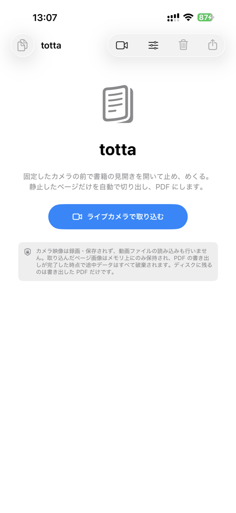
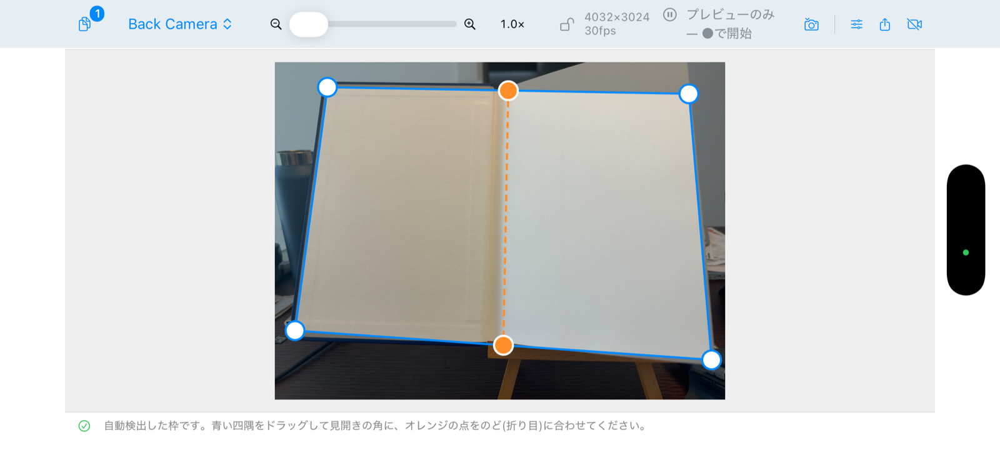

# totta

固定したカメラの前で本の見開きを開いて止め、めくる。それだけで静止したページを自動で切り出し、**OCR テキスト付きの PDF** にする macOS / iOS アプリです。

<p align="center">
  
  &nbsp;&nbsp;
  
</p>

## 特徴

- **入力はライブカメラのみ**。静止を検知して自動で取り込み、めくると次のページを待つ
- 見開きを四隅+のど線で台形補正し、左右ページに分割して書き出す
- 紙面の照明ムラを補正し、Vision のオンデバイス OCR(日本語/英語)で透明テキスト層を付ける
- 既定でグレースケール・長辺 2400px・JPEG q0.75。LLM に渡しやすいサイズ(1 章 30MB 未満)に収まる
- OCR を読み順に整列した Markdown も同時に書き出せる(RAG 向け)

## データ保持ポリシー

- カメラ映像は録画・一時保存しない。動画ファイルの読み込み機能もない
- 取り込んだページはメモリ上にだけ保持し、ディスクに書くのは**書き出した最終 PDF だけ**
- PDF 保存が完了した時点で途中データはすべて破棄する

## ビルド

```sh
brew install xcodegen
xcodegen generate
open Totta.xcodeproj          # スキーム Totta (macOS) / Totta-iOS

xcodebuild -project Totta.xcodeproj -scheme Totta -configuration Debug build
cd Core && swift test         # Core のテスト
```

iPhone 実機へは `scripts/install-iphone.sh`(要 `project.yml` の `DEVELOPMENT_TEAM` 設定)。

## 構成

```
Core/         Swift Package(macOS 14+ / iOS 17+)— 静止検出・枠検出・補正・OCR・PDF/Markdown 書き出し
App/Totta/    SwiftUI アプリ(macOS / iOS 共通)
scripts/      実機インストール、PDF テキスト層の抽出(pdftext.py)
project.yml   xcodegen 定義
```

## 詳細

操作手順・iPhone での使い方・撮影のコツ・補正/OCR/書き出しの実装メモは **[USAGE.md](USAGE.md)** を参照してください。

## ライセンス

[MIT License](LICENSE)
